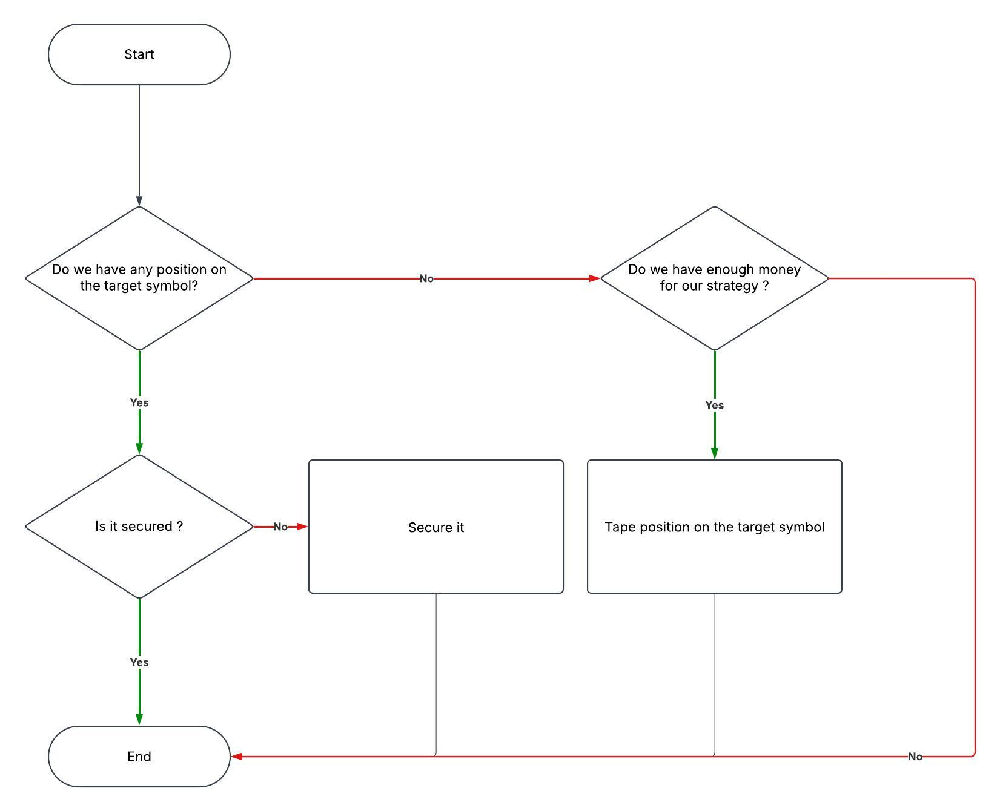

# A binance trading bot written in python

## My Strategy:
### Invest 10% of my usdt balance:
Invest 10% of my usdt balance only if it's worth $100 or more placing a buy market order with a 3x leverage in ISOLATED type. 
### Secure my position:
Then i place a take profit order when my unrealized profit is greater than or equal to 10% of my position size;
a buy market order just above my liquidation price with amount that is twice my current position size;
finally i place a buy market order just above my take profit price with 10% of my current balance;

1. Check  if any position is open
2. If there is no position open, check if the balance is greater than $100
3. If the balance is greater than $100, place a buy market order with 3x leverage in ISOLATED type
4. Place a take profit order when the unrealized profit is greater than or equal to 10% of the position size
5. Place a buy market order just above the liquidation price with an amount that is twice the current position size
6. Place a buy market order just above the take profit price with 10% of the current balance

Tested on chart from 2021 to 2023 it gave 254% ROI on BTCUSDT.

Here is a general flowchart of my strategy:

